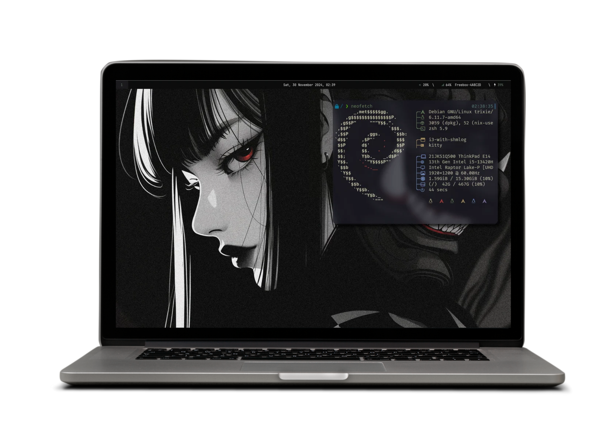
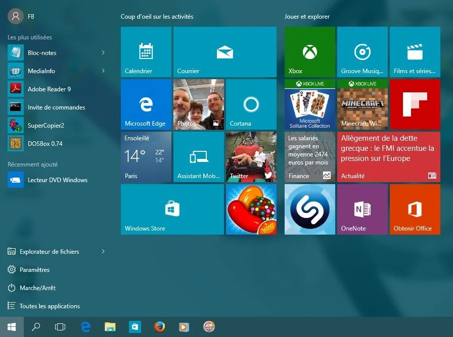
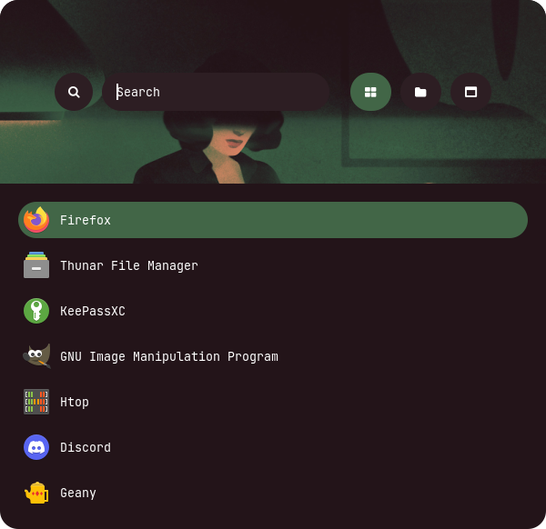

My goal in creating these dotfiles was to combine a productive workstation with a pleasing design. I want my environment to be visually appealing while remaining free from unnecessary distractions. This is why I came to linux. I believe it’s also important to enjoy using your computer—it’s like tackling a difficult task: having something enjoyable along the way makes the process more bearable. Without that, it’s hard to stay motivated. I apply this same philosophy to my computer setup.


1. [**My Philosophy**](#my-philosophy)  
2. [**My Packages and Apps**](#my-packages-and-apps)  
3. [**Non-Default Shortcuts**](#non-default-shortcuts)  
4. [**Installation**](#installation)  

## My philosophy

Whenever I consider adding a feature, I ask myself:  
- Why do I need this?  
- Will it improve my productivity?  
- Is there a better way to achieve the same result?  

I also want my apps to focus on doing one thing well. I try to avoid bloat as much as possible, as I believe bloated apps hinder concentration and productivity. They make it harder to find what you need, and their cluttered interfaces can overwhelm your focus.  

For example, if I’m searching for an application launcher, I want a quick, simple menu to search for applications. I don’t need it searching the internet, teaching me how to bake cookies, or serving me a cold drink of water (though that last one would be nice).

<details>
  <summary><strong>Example of a bloated app</strong></summary>
  <p></p>
</details>

<details>
  <summary><strong>Example of a non-bloated app</strong></summary>
  <p></p>
</details> 

## My packages and apps

### Polybar
A highly customizable taskbar.

### Rofi
Application launcher and power menu

### Kitty
A GPU based terminal emulator with a focus on performance and customization.

### Neovim
Text and code editor.

### Picom
For subtle animations and transparency/blurry effects.

### Zen Browser
 A minimalist, Firefox-based browser with a beautiful monochrome theme focused on distraction-free browsing.

### Obsidian
Markdown note taking app also in a monochrome theme.

## Non default shortcuts

- **$mod + t**: Launch Kitty in a floating window.
- **$mod + d**: Open rofi dmenu.
- **$mod + l**: Open rofi power menu.
- **Print**: Launch Flameshot GUI to take screenshot.
- **F5 / F6**: Adjust screen brightness (decrease/increase).
- **F2 / F3**: Adjust volume (decrease/increase).
- **F1**: Mute volume.

## Installation

**WILL ONLY WORK ON DEBIAN-BASED DISTROS**  
If you're not on a Debian-based distro, please install the packages manually.

```bash
cp -r ~/.config ~/config_backup
git clone https://github.com/Juicyyyyyyy/dotfiles ~/.config
```

This command may create conflicts if you already have some of my packages installed, so make sure you know how to handle conflicts or clean your `.config` folder beforehand.  
The previous command will also back up your `.config` folder to `~/config_backup`, allowing you to retrieve your old `.config` in case something breaks.

```bash
cd ~/.config
./setup.sh
```

This script will automatically execute the `install_packages`, `set_config`, and `set_fonts` scripts you can find in `~/.config/scripts`.

Finally, you need to configure **rofi**:

```bash
cd ~/.config/rofi
./setup.sh
```

